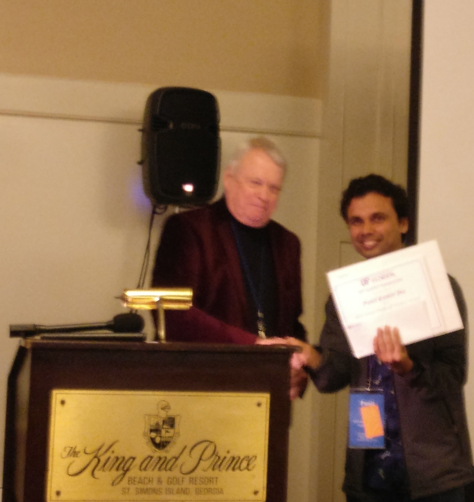

---
title: "Background"
---

  
I am a currenlty a fifth-year Ph.D candidate in [Chemistry](https://chemistry.illinois.edu/) at the University of Illinois at Urbana-Champaign. 
  
I did my undergraduate and master's in chemistry at the [National Institute of Science Education and Reserach](https://www.niser.ac.in/), Bhubaneswar, India. My M.Sc. research project on nuclear magenetic resonance spectroscopy (NMR), and I worked with 2D NMR experiments. For general details on my Ph.D. research and the projects that I have worked on please see the ["Projects"](https://punitjha.github.io/projects.html) section of my website. 

You can checkout my Google Scholar profile [here](https://scholar.google.com/citations?user=XmN4PKgAAAAJ&hl=en) for details of my publications and citations. 

***  
### Education
- University of Illinois at Urbana-Champaign, Urbana-Champaign, IL. 
 5th Year Ph.D. Candidate, Department of Chemistry, Aug 2016 -- Present
 
- National Institute of Science Education and Research,Bhubaneswar, India. 
 Integrated Master of Science (M. Sc.), School of Chemical Sciences, Aug 2011 -- June 2016

***  
### List of Publications
- **S. Hirata and Punit  K. Jha**, Finite-temperature many-body perturbation theory in the grand canonical ensemble,  J. Chem. Phy., **153**, 014103, 2020.[]
- **Punit K. Jha and S. Hirata**, Finite-temperature many-body perturbation theory in the canonical ensemble, Phys. Rev. E, **101**, 022106, 2020.
- **S. Hirata and Punit K. Jha**, Converging finite-temperature many-body perturbation theory in the grand canonical ensemble that conserves the average number, Annu. Rep. Comput. Chem., **15**, 17-37, 2019.
- **Punit K. Jha and S. Hirata**, Numerical evidence invalidating finite-temperature many-body perturbation theory, Annu. Rep. Comput. Chem., **15**, 3-15, 2019.

***

### Presentations
- **"Diagonal Suppressed Correlation Spectroscopy (COSY)"**, M. Sc. research presentation in the 7th, 8th, 9th and 10th semesters at Departmental Seminar of the School of Chemical Sciences, NISER, Bhubaneswar, 2015-16, talk.
- **"Research at the  School of Chemical Sciences, NISER, Bhubaneswar"**, Inauguration Day of new NISER campus by the Honorable Prime Minister of India Shree Narendra Modi, 2016, poster.
- **"Advancing Moore's Law Through Multi-Gated Transistors"**, Physical Chemistry Lit. Seminars, at the Department of Chemistry, UIUC, 2017, talk.
- **"Numerical Evidence Invalidating Finite-Temperature Many-Body Perturbation Theory"**, 59th Sanibel Symposium, 2019, talk.

***
### Courses Taken
  
Here is list of relevant courses that I have done at the Univeristy of Illinios and NISER, India.

#### [**Univeristy of Illinios:**](https://chemistry.illinois.edu/)
- Data Science \& Eng.  
- Quantum Mech. \& Spectrosc. 
- Molecular Electronic Structure 
- Quantum Mechanics 
- Statistical Thermodynamics 
- Parallel Prog.: Sci \& Engrg 

#### [**NISER:**](https://stat.illinois.edu/)  
- Probablity Theory  
- Computational Physics  
- Biophysics and Statistics
- Linear Algebra- II
- Numerical Methods in C++ 
- Classical Mechanics- I
- NMR Theory
- Organic chemistry- I \& II
- Quantum Chemistry- I \&  II
- Introduction to Economics
- Sociology
- History of Science

#### **Online Courses**

- Machine Learning (Online via Coursera)
- Data Structures in C++ (Online via Coursera)

  
***
### Courses Taught
- Fall 2016, CHEM 445/447 - Physical Principles Lab
- Fall 2016, CHEM 440 - Physical Chemistry Principles
- Spring 2017, CHEM 104 - General Chemistry II
- Fall 2017, CHEM 440 - Physical Chemistry Principles
- Spring 2018, CHEM 445/447 - Physical Principles Lab

***
  
### Honors and Awards
- 2019, CATMS Travel Award
- 2019, Drickamer Research Fellowship
- 2019, IBM-Zerner Graduate Student Award
- 2018, J. C. Martin Memorial Student Travel Award
- 2017, Chemical Sloan Fellowship
- 2016, Saryu Doshi Post Graduate Fellowships in Liberal Arts \& Sciences
- 2016, Dornsife Fellowship
- 2016, Virginia Bartow Scholarship
- 2016, Hannum Fellowship
- 2015, MITACS Globalink Fellowship
- 2012, Academic Excellence Award
- 2011, Innovation in Science Pursuit for Inspired Research (INSPIRE) by Govt. of India

***
  
### Computational Skills
- **Prgaramming Languages**   
  - C++, Python, FORTRAN, Mathematica, GNU Octave, Shell, TopSpin, LaTeX, Matlab.
- **Software Packages**  
  - PSI-4, PySCF, Gaussian, Gensim, spaCY, Scikit-Learn.
- **Microsoft Word**  
  - Excel, Outlook, PowerPoint, Word

*** 
